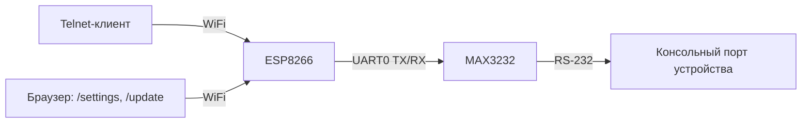

# ESP8266 WiFi Console Server

Автономный WiFi-переходник для консольного (RS-232) порта сетевого оборудования: ESP8266 + преобразователь уровней MAX3232 + telnet-мост.

**Сценарий — первичная настройка коммутаторов и МСЭ.** Устройство лежит в сумке и достаётся под конкретную задачу: подключиться к незнакомой железке, поймать её загрузку, при необходимости прервать автозагрузку и довести до управляемого состояния. Из этого сценария следуют почти все решения в прошивке: скорость меняется на лету, история вывода не теряется, BREAK отправляется штатно, а ESP не перезагружается никогда.

## Возможности

- **Telnet-мост** консоль ↔ WiFi, порт 23, корректный разбор IAC через конечный автомат, экранирование 0xFF по RFC 854
- **Буфер истории 8 КБ** — вывод, который железка напечатала *до* подключения клиента (POST, загрузчик, приглашение), отдаётся целиком при коннекте
- **Отправка BREAK** — для входа в `rommon` / BootROM и сброса пароля. Из telnet-клиента (PuTTY: *Special Command → Break*) или удержанием кнопки
- **Смена скорости без перезагрузки** — кнопкой по кругу или в веб-интерфейсе, применяется мгновенно
- **AP + опциональный STA**: точка доступа поднята всегда; STA включается, только если задан домашний SSID
- **mDNS** `esp-console.local` и **captive portal** — страница настроек открывается сама при подключении к точке доступа
- **Веб-интерфейс** (`/settings`): скорость, WiFi, PIN — за HTTP Basic Auth с блокировкой после 5 неудачных попыток
- **Выгрузка лога** (`/log`) — весь буфер истории скачивается файлом из браузера: готовый протокол работ по железке
- **OTA-обновление** прошивки через браузер (`/update`)
- **OLED-экран** (128×64, SSD1306): IP, крупно текущая скорость, заряд батареи, статус telnet-сессии. Гаснет через 60 с простоя

## Железо

| Компонент | Примечание |
|---|---|
| ESP8266 (Wemos D1 mini или совместимая) | основная плата |
| MAX3232, модуль HW-044 | преобразователь уровней RS-232 ↔ TTL |
| Патчкорд RJ45 (обрезанный) | консольный кабель Cisco/Huawei-style |
| OLED SSD1306 128×64, I2C | статусный экран |
| Тактовая кнопка | **опционально**, см. ниже |
| 2× резистор 100 кОм | делитель напряжения для измерения батареи |
| Li-ion/LiPo батарея 3.7В | опционально, для автономной работы |
| TP4056 + защита от переразряда | рекомендуется, если батарея без встроенной BMS |

## Схема подключения

**Консоль (аппаратный UART0):**

| D1 mini | HW-044 |
|---|---|
| TX | TXD |
| RX | RXD |
| 3V3 | VCC |
| G | GND |

**RS-232 → RJ45** (на модуле HW-044, распиновка патчкорда):

| Пятак модуля | Пин RJ45 | Провод (T568B) | Назначение на стороне железки |
|---|---|---|---|
| T1OUT (≈ −5В, выход) | 6 | зелёный | RxD — приём коммутатора |
| R1IN (≈ 0В, вход) | 3 | бело-зелёный | TxD — передача коммутатора |
| GND | 4, 5 | синий + бело-синий | земля |

Контакты RJ45 1, 2, 7, 8 не используются — обрезать и заизолировать. Раскладка соответствует консольному порту Cisco/Huawei, кабель — обычный патчкорд, не rollover.

Сигнальные 3 и 6 — это одна витая пара (зелёная), земля идёт синей парой; так и устроена консольная раскладка Cisco.

Цвета в таблице приведены для **T568B** (порядок в вилке: бело-оранжевый, оранжевый, бело-зелёный, синий, бело-синий, зелёный, бело-коричневый, коричневый). Если патчкорд собран по **T568A**, зелёная и оранжевая пары меняются местами: контакт 3 станет бело-оранжевым, контакт 6 — оранжевым, синяя пара на 4/5 остаётся без изменений.

**Как найти T1OUT и R1IN на конкретной плате.** У модулей с разъёмом DB9 встречаются обе разводки (DTE и DCE), в которых пины 2 и 3 меняются ролями, поэтому определять нужно по своей плате, а не по схеме из интернета. Два способа:

- *прозвонкой*, без питания — пятаки идут к ногам микросхемы MAX3232 (SO-16): нога **14** = T1OUT, нога **13** = R1IN, нога **15** = GND;
- *под питанием*, когда ESP ничего не передаёт — измерить напряжение пятака относительно GND: **−5…−9 В** это выход T1OUT (в покое RS-232 держит MARK), **около 0 В** — вход R1IN (внутри резистор 5 кОм на землю).

Перепутанные 3 и 6 ничего не сжигают — просто не будет данных: выходы MAX3232 защищены от короткого и встречного напряжения. Так что при сомнениях допустимо просто попробовать и поменять сигнальные провода местами.

**Если стандарт обжима кабеля неизвестен** — определите провода прозвонкой, а не по цвету. Нумерация контактов вилки: держать защёлкой вниз, контактами к себе, кабелем от себя — контакт 1 слева. Проверка ориентации: прочитанная последовательность цветов должна совпасть с T568A или T568B; если получилась обратная — вилка перевёрнута.

> ⚠️ Готовую вилку нельзя втыкать в сетевой порт: по ней ходит ±9 В, а PoE подаст 48 В прямо в MAX3232 и дальше в ESP. Подпишите разъём.

**OLED (I2C):**

| D1 mini | OLED |
|---|---|
| D1 (GPIO5, SCL) | SCL |
| D2 (GPIO4, SDA) | SDA |
| 3V3 | VCC |
| G | GND |

**Кнопка (опционально):** тактовая кнопка между **D7 (GPIO13)** и **GND**. Пин подтянут внутренним резистором, поэтому без кнопки прошивка работает как обычно.

| Действие | Результат |
|---|---|
| Короткое нажатие, экран погашен | разбудить экран (скорость не меняется) |
| Короткое нажатие, экран горит | следующая скорость по кругу |
| Удержание ≈1 сек | отправить BREAK в консоль |

**Батарея** (делитель обязателен — не подключать батарею к A0 напрямую):

```
Batt+ --[R1 100к]-- A0 --[R2 100к]-- GND
```

## Архитектура прошивки



Один файл `firmware/firmware.ino`, логически разбит на блоки:

- **Settings** — структура в EEPROM с magic-байтом и полем версии; запись в flash отложена на 5 с, чтобы перебор скорости кнопкой не стирал сектор на каждое нажатие
- **История** — кольцевой буфер 8 КБ. Всё, что приходит из UART, пишется сюда; telnet-клиент читает отсюда же, поэтому «живой» и «исторический» трафик идут по одному пути и не могут перепутаться местами
- **Telnet-мост** — конечный автомат разбора IAC (`TN_DATA/TN_IAC/TN_OPT/TN_SB/TN_SB_IAC`), переживающий разрыв команды на границе TCP-пакета
- **BREAK** — GPIO1 временно отцепляется от UART0 и удерживается в LOW; на выходе MAX3232 это SPACE, то есть настоящий break condition
- **Веб-сервер** — `ESP8266WebServer` на порту 80, страница отдаётся чанками (`CONTENT_LENGTH_UNKNOWN`), плюс `DNSServer` для captive portal
- **OLED** — перерисовка только при изменении содержимого, гашение по таймауту
- **Батарея** — один отсчёт A0 за проход `loop()` со скользящим средним, кусочно-линейная кривая Li-ion

### Что здесь сделано ради стабильности моста

Устройство обязано не терять байты консоли. Отсюда:

- в `loop()` нет ни одного `delay()`, кроме собственно генерации BREAK;
- `Serial.setRxBufferSize(2048)` — стандартных 256 байт не хватает, чтобы пережить перерисовку экрана на 115200;
- OLED перерисовывается только когда картинка изменилась, а не раз в секунду;
- запись в UART идёт под контролем `Serial.availableForWrite()`: при вставке конфига из буфера обмена мост не блокируется на секунды, а закрывает TCP-окно и тормозит отправителя;
- отправка в TCP — блоками, с оглядкой на `availableForWrite()`, а не побайтно.

## Первый запуск

1. Прошить по USB **без** подключенного HW-044 (иначе CH340 и MAX3232 конфликтуют за линию RX)
2. Убедиться, что появилась точка доступа `ESP-Console` и OLED показывает статус
3. Подключиться к точке доступа (пароль по умолчанию `console123`) — страница настроек должна открыться сама (captive portal)
4. Если не открылась — `http://192.168.4.1` или `http://esp-console.local`, логин `admin` / PIN `1234`
5. Сразу сменить пароль точки доступа и PIN
6. Отключить питание, припаять HW-044 к TX/RX и (опционально) кнопку на D7
7. Дальше — только OTA через `/update` (Arduino IDE: Sketch → Export Compiled Binary, полученный `.bin` загрузить через веб-форму)

## Работа на объекте

1. Воткнуть консоль, подать питание на железку — вывод копится в буфере, даже если вы ещё не подключились
2. Подключиться к `ESP-Console`, открыть telnet на `esp-console.local:23` (или `192.168.4.1:23`) — история отдастся сразу
3. Не та скорость — короткое нажатие кнопки до читаемого текста (или выбрать в `/settings`)
4. Нужен `rommon` / BootROM — удержать кнопку ≈1 сек или *Special Command → Break* в PuTTY
5. Отошли и телефон потерял сеть — просто подключитесь заново, новая сессия вытеснит зависшую

## Настройки по умолчанию

| Параметр | Значение |
|---|---|
| SSID точки доступа | `ESP-Console` |
| Пароль точки доступа | `console123` |
| Логин / PIN веб-интерфейса | `admin` / `1234` |
| IP точки доступа | `192.168.4.1` |
| Имя в сети | `esp-console.local` |
| Скорость консоли | 9600 |
| Telnet-порт | 23 |
| Таймаут простоя telnet | 10 мин |
| Таймаут гашения экрана | 60 с |

Всё хранится в EEPROM и переживает перезагрузку.

## Известные ограничения

- Один telnet-клиент одновременно; новый **вытесняет** старого (при первичной настройке работает один инженер, а отказ в подключении после роуминга заблокировал бы его самого)
- Только RS-232. Часть современных МСЭ и коммутаторов имеет консоль на USB-C с конвертером внутри — там нужен ноутбук, ESP8266 не может быть USB-хостом
- OLED без кириллицы: штатный шрифт Adafruit_GFX её не поддерживает (для кириллицы — переход на u8g2)
- При включении питания ESP в консоль на мгновение прилетает бутлоадерный мусор на 74880 бод. Прошивка не вызывает `ESP.restart()` ни при одной настройке, поэтому в рабочем цикле это происходит только при подаче питания и после OTA
- HTTP Basic Auth защищает от случайного доступа, не от перехвата в общей WiFi-сети (нет HTTPS). Есть блокировка на 60 с после 5 неудачных попыток
- ADC для батареи требует калибровки под конкретный экземпляр платы — константа `ADC_FULL_SCALE` в коде
- ESP8266 не умеет держать AP и STA на разных каналах одновременно — канал точки доступа подстраивается под домашнюю сеть при подключении к ней
- `HISTORY_SIZE` (8 КБ) занимает статическую RAM. Свободная память показана на `/settings`; если её меньше ~12 КБ — уменьшить до 4096

## Совместимость

Прошивка рассчитана на **ESP8266 core 3.x**. Используются `WiFiClient::keepAlive()`, `WiFiClient::availableForWrite()`, `HardwareSerial::updateBaudRate()`, `HardwareSerial::setRxBufferSize()`, `ESP8266HTTPUpdateServer::updateCredentials()`. На core 2.x часть из них отсутствует.

**Обновление с v1.0:** структура настроек в EEPROM получила поле версии, поэтому при первом старте v1.1 применятся значения по умолчанию — пароль точки доступа и PIN нужно задать заново.

## История версий

**v1.2.0**

- Эндпоинт `/log` — выгрузка буфера истории файлом через браузер, за тем же PIN
- `sendBreak()` дочитывает приёмный буфер перед `Serial.begin()`: ответ железки на break больше не теряется при переинициализации UART

**v1.1.0**

- Скорость консоли применяется без перезагрузки; `ESP.restart()` убран полностью, настройки AP/STA применяются на лету
- Добавлены буфер истории, отправка BREAK (IAC BRK и кнопка), кнопка на D7
- Разбор IAC переписан на конечный автомат (прежний терял байт, если пакет обрывался на 0xFF); добавлено экранирование 0xFF в обратную сторону
- Новый telnet-клиент вытесняет старого, добавлен таймаут простоя
- Убраны блокировки `loop()`: ADC без `delay()`, перерисовка OLED по изменению, `Wire.setClock(400000)`, увеличен RX-буфер UART
- Скорость из формы проверяется по белому списку (раньше `baud=1` выводил устройство из строя)
- Пароли больше не подставляются в HTML; добавлена блокировка перебора PIN
- Добавлены mDNS, captive portal, режим AP-only при незаданном STA, снижение мощности передатчика, гашение экрана
- Поле версии в структуре EEPROM, отложенная запись во flash, `WiFi.persistent(false)`
- На экран выведены текущая скорость и версия прошивки; кривая заряда Li-ion сделана кусочно-линейной

**v1.0** — исходная версия, в репозитории не хранится

## Библиотеки Arduino

- ESP8266 core 3.x (Board Manager → «esp8266 by ESP8266 Community»)
- Adafruit SSD1306 (Library Manager, подтянет зависимость Adafruit BusIO)
- Adafruit GFX Library (Library Manager)

## Структура репозитория

```
esp-wifi-console/
├── README.md
├── .gitignore
└── firmware/
    └── firmware.ino
```

Имя папки скетча должно совпадать с именем `.ino` — это требование Arduino IDE, поэтому скетч называется `firmware.ino` внутри папки `firmware`. Открывать в IDE нужно именно этот файл.

## Лицензия

MIT — см. [LICENSE](LICENSE).
